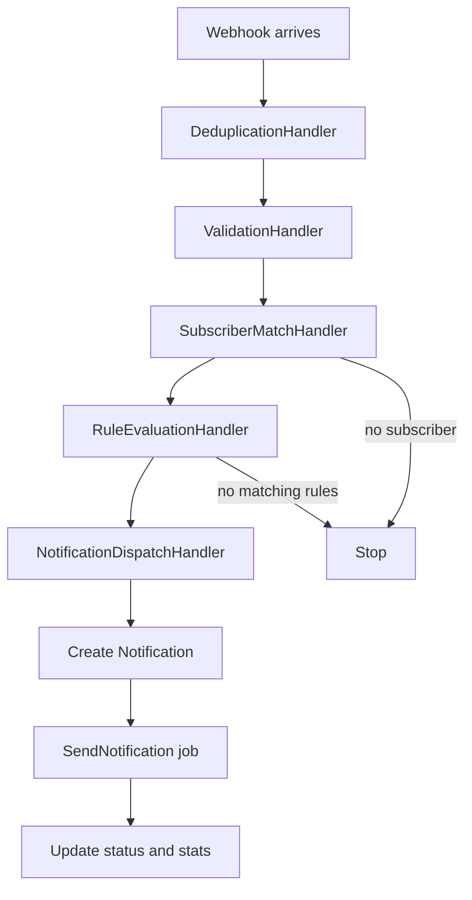
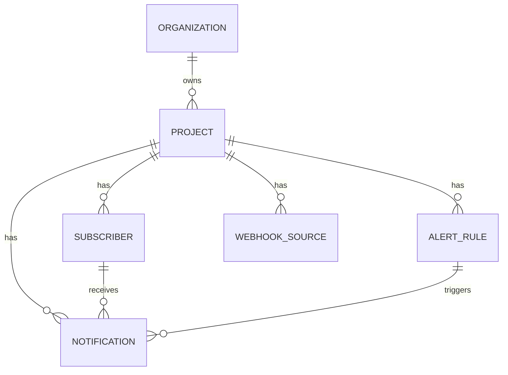

# AlertHub

AlertHub is a multi-tenant Laravel API for webhook-driven alert notifications.

## Setup

```bash
composer install
cp .env.example .env
php artisan key:generate
php artisan migrate --seed
php artisan queue:work
```

For this local Laragon workspace, PHPUnit uses a MySQL database named `alerthub_test` because the available PHP binaries do not include `pdo_sqlite`.

```bash
php artisan test
```

## Architecture

- One organization owns each request, project, and related record.
- Webhooks are processed in the background and turned into notifications.
- A created notification triggers follow-up updates for stats and escalation.
- The webhook pipeline filters duplicates, validates data, matches rules, and creates notifications.
- `Services/AlertProcessing` keeps that webhook flow in small steps instead of one large file.
- `ProcessWebhookEvent` handles the incoming webhook, while `SendNotification` updates the notification after it is created.
- Inside that folder:
  - `Pipeline` runs each processing step in order.
  - `WebhookProcessingContext` carries the webhook data through the flow.
  - `HandlerResult` tells the pipeline whether to continue, stop, or jump to dispatch.
  - `DeduplicationHandler` skips repeated events.
  - `ValidationHandler` checks the payload shape.
  - `SubscriberMatchHandler` finds the subscriber.
  - `RuleEvaluationHandler` finds the matching alert rules.
  - `NotificationDispatchHandler` creates the notification row and queues sending.
- Splitting the flow into small handlers keeps each part focused on one job, so the webhook logic is easier to understand, safer to change, and simpler to test.
- It also makes it easier to add a new step later, like extra validation, a new matching rule, or a different delivery path, without rewriting the whole flow.
- Background jobs use retries, deduplication, and failure handling.
- The older `AlertMetrics` package is still included for legacy support.

### Webhook Flow



What this means:

- `SubscriberMatchHandler` decides who the alert is for.
- `RuleEvaluationHandler` decides whether the event matches one or more alert rules.
- `NotificationDispatchHandler` creates one notification per matched rule and queues delivery.

### Data Relationships



How to read it:

- an organization owns many projects
- a project has many subscribers, alert rules, webhook sources, and notifications
- each notification belongs to one subscriber and one alert rule
- the webhook flow uses subscriber matching plus rule matching to create that notification link

## API

All project API endpoints require:

```http
Authorization: Bearer {organization_api_token}
Accept: application/json
```

Seeded demo tokens:

- `acme-alerts-token`
- `globex-monitoring-token`

Endpoints:

- `GET /api/projects`
- `POST /api/projects`
- `GET /api/projects/{id}`
- `PUT /api/projects/{id}`
- `GET /api/projects/{id}/subscribers`
- `POST /api/projects/{id}/subscribers`
- `GET /api/projects/{id}/notifications`
- `GET /api/projects/{id}/alert-rules`
- `POST /api/projects/{id}/alert-rules`
- `POST /api/projects/{id}/webhook-sources`

## API Controllers

These controllers handle the API routes:

- `ProjectController` handles project list, create, view, and update actions.
- `ProjectSubscriberController` handles subscriber list and create actions for a project.
- `ProjectNotificationController` handles notification list actions for a project.
- `ProjectWebhookSourceController` handles adding webhook sources to a project.
- `WebhookController` handles incoming public webhook requests and sends them into the processing queue.

In simple terms:

- the `ProjectController` manages the project itself
- the subscriber and notification controllers manage project data
- the webhook source controller registers where events come from
- the webhook controller receives outside events and starts alert processing

## Database Tables

Main app tables:

- `organizations` stores each tenant, its API token, plan, and timezone.
- `projects` stores alert projects for each organization.
- `subscribers` stores alert recipients and their notification stats.
- `alert_rules` stores the conditions that decide when an event becomes an alert.
- `notifications` stores each created alert notification and its delivery status.
- `webhook_sources` stores each project webhook endpoint and its signing details.

Laravel support tables:

- `users` stores standard Laravel user accounts.
- `password_reset_tokens` stores password reset data.
- `sessions` stores session data when database sessions are enabled.
- `cache` and `cache_locks` store cache entries and lock data.
- `jobs`, `job_batches`, and `failed_jobs` store queued jobs, batch tracking, and failures.

List endpoints support offset pagination by default and cursor pagination with `?pagination=cursor`. Supported relations can be loaded with `includes`, for example:

```http
GET /api/projects/1?includes=subscribers,alert_rules
```

## API Result

Sample responses based on the actual API resource shapes:

`GET /api/projects?includes=subscribers,alert_rules`

```json
{
  "data": [
    {
      "id": 1,
      "uuid": "2f3c9d8e-7a91-4b8c-9d17-1f7c0e5d1a01",
      "organization_id": 1,
      "name": "Payments API",
      "description": "Payment alerts and integrations",
      "created_at": "2026-05-01T08:15:00.000000Z",
      "updated_at": "2026-05-01T08:15:00.000000Z",
      "subscribers": [
        {
          "id": 10,
          "project_id": 1,
          "email": "ops-team@example.com",
          "external_id": "ops-team",
          "name": "Ops Team",
          "notification_count": 4,
          "last_notified_at": "2026-05-02T08:15:00.000000Z",
          "metadata": {
            "team": "ops"
          },
          "engagement_score": 82.5,
          "engagement_tier": "high",
          "created_at": "2026-05-01T08:15:00.000000Z",
          "updated_at": "2026-05-02T08:15:00.000000Z",
          "notifications": []
        }
      ],
      "alert_rules": [
        {
          "id": 3,
          "project_id": 1,
          "name": "Critical monitoring incidents",
          "source_type": "monitoring",
          "event_type": "alert.triggered",
          "conditions": {
            "severity": "critical"
          },
          "action": "escalate",
          "priority": "critical",
          "is_active": true,
          "created_at": "2026-05-01T08:15:00.000000Z",
          "updated_at": "2026-05-01T08:15:00.000000Z",
          "notifications": []
        }
      ],
      "notifications": [],
      "webhook_sources": []
    }
  ],
  "links": {
    "first": "http://alerthub.test/api/projects?page=1",
    "last": "http://alerthub.test/api/projects?page=1",
    "prev": null,
    "next": null
  },
  "meta": {
    "current_page": 1,
    "from": 1,
    "last_page": 1,
    "path": "http://alerthub.test/api/projects",
    "per_page": 15,
    "to": 1,
    "total": 1
  }
}
```

`GET /api/projects/{id}`

```json
{
  "id": 1,
  "uuid": "2f3c9d8e-7a91-4b8c-9d17-1f7c0e5d1a01",
  "organization_id": 1,
  "name": "Payments API",
  "description": "Payment alerts and integrations",
  "created_at": "2026-05-01T08:15:00.000000Z",
  "updated_at": "2026-05-01T08:15:00.000000Z",
  "subscribers": [],
  "alert_rules": [],
  "notifications": [],
  "webhook_sources": []
}
```

`GET /api/projects/{id}/notifications?includes=subscriber,alert_rule`

```json
{
  "data": [
    {
      "id": 44,
      "uuid": "f2b8af19-5f5e-4c65-8d74-9a3e7f1aa301",
      "project_id": 1,
      "subscriber_id": 10,
      "alert_rule_id": 3,
      "channel": "email",
      "subject": "Critical monitoring incidents",
      "body": "Response time exceeded 5s threshold",
      "payload": {
        "event_type": "alert.triggered",
        "severity": "critical"
      },
      "status": "sent",
      "sent_at": "2026-05-02T08:20:00.000000Z",
      "created_at": "2026-05-02T08:20:00.000000Z",
      "updated_at": "2026-05-02T08:20:00.000000Z",
      "subscriber": {
        "id": 10,
        "project_id": 1,
        "email": "ops-team@example.com",
        "external_id": "ops-team",
        "name": "Ops Team",
        "notification_count": 4,
        "last_notified_at": "2026-05-02T08:15:00.000000Z",
        "metadata": {
          "team": "ops"
        },
        "engagement_score": 82.5,
        "engagement_tier": "high",
        "created_at": "2026-05-01T08:15:00.000000Z",
        "updated_at": "2026-05-02T08:15:00.000000Z",
        "notifications": []
      },
      "alert_rule": {
        "id": 3,
        "project_id": 1,
        "name": "Critical monitoring incidents",
        "source_type": "monitoring",
        "event_type": "alert.triggered",
        "conditions": {
          "severity": "critical"
        },
        "action": "escalate",
        "priority": "critical",
        "is_active": true,
        "created_at": "2026-05-01T08:15:00.000000Z",
        "updated_at": "2026-05-01T08:15:00.000000Z",
        "notifications": []
      }
    }
  ],
  "links": {
    "first": "http://alerthub.test/api/projects/1/notifications?page=1",
    "last": "http://alerthub.test/api/projects/1/notifications?page=1",
    "prev": null,
    "next": null
  },
  "meta": {
    "current_page": 1,
    "from": 1,
    "last_page": 1,
    "path": "http://alerthub.test/api/projects/1/notifications",
    "per_page": 15,
    "to": 1,
    "total": 1
  }
}
```

## Webhooks

The webhook endpoint is public and identifies the destination by project UUID and source key:

```http
POST /api/webhooks/{project_uuid}/{source_key}
```

In short, this endpoint receives an event, validates it, matches it to a project and subscriber, creates a notification, and queues the send job.

Simple flow:

- webhook arrives
- event is validated and deduplicated
- subscriber and alert rule are matched
- a notification row is created
- the send job updates that row to `sent` or `escalated`

If a webhook source has a signing secret, send the HMAC SHA-256 signature in `X-AlertHub-Signature` or `X-Hub-Signature-256`.

Example monitoring payload:

```json
{
  "event_type": "alert.triggered",
  "source": "monitoring",
  "payload": {
    "alert_id": "mon-789",
    "severity": "critical",
    "service": "api-gateway",
    "message": "Response time exceeded 5s threshold",
    "contact": {
      "external_id": "ops-team"
    }
  }
}
```

## Digest Scheduling

Digest scheduling is used to group many alert notifications into a digest instead of sending each one individually right away.

This is useful when a project receives a lot of alerts in a short time. Rather than spamming the subscriber with separate emails, the system collects the alerts for a given day, groups them by subscriber, and sends a summary digest job.

What the scheduler does:

- finds subscribers in the project who already have sent notifications for the selected date
- collects the matching notification IDs for each subscriber
- fires the `DigestScheduled` event so digest listeners can set metadata
- dispatches `ProcessAlertDigest` to build the digest message

What the digest job produces:

- one digest notification per subscriber per batch
- a subject like `Alert Digest: 5 alerts for 2026-05-01`
- a body that includes total alert count, high-priority count, digest type, and a list of included alerts
- a separate engagement score calculated in `digest` context

Command example:

```bash
php artisan alerthub:schedule-digests 1 --date=2026-05-01 --type=daily
```

Notes:

- `project_id` tells the scheduler which project to process
- `--date` controls which day’s notifications are grouped
- `--type` can be `daily` or `weekly`
- the job is unique per subscriber/date/batch so duplicate digest runs do not stack up
- the digest pipeline also calculates a delivery window and priority before sending

## Bug Report

Legacy module investigation and fixes for AH-101 through AH-105 are documented in `BUG_REPORT.md`.

## AlertMetrics Test

`AlertMetricsIntegrationTest` checks the legacy alert metrics flow end to end:

- project data stays separate
- webhook subscribers can be matched without email
- digest jobs run in the right order
- duplicate digest batches stay unique
- engagement scores do not leak between digest and realtime use

## Demo Flow

1. Run `php artisan migrate --seed`.
2. Use `GET /api/projects` with `Authorization: Bearer acme-alerts-token`.
3. Register or use a seeded webhook source for a project.
4. Send `POST /api/webhooks/{project_uuid}/{source_key}`.
5. Run a queue worker and inspect `GET /api/projects/{id}/notifications`.
